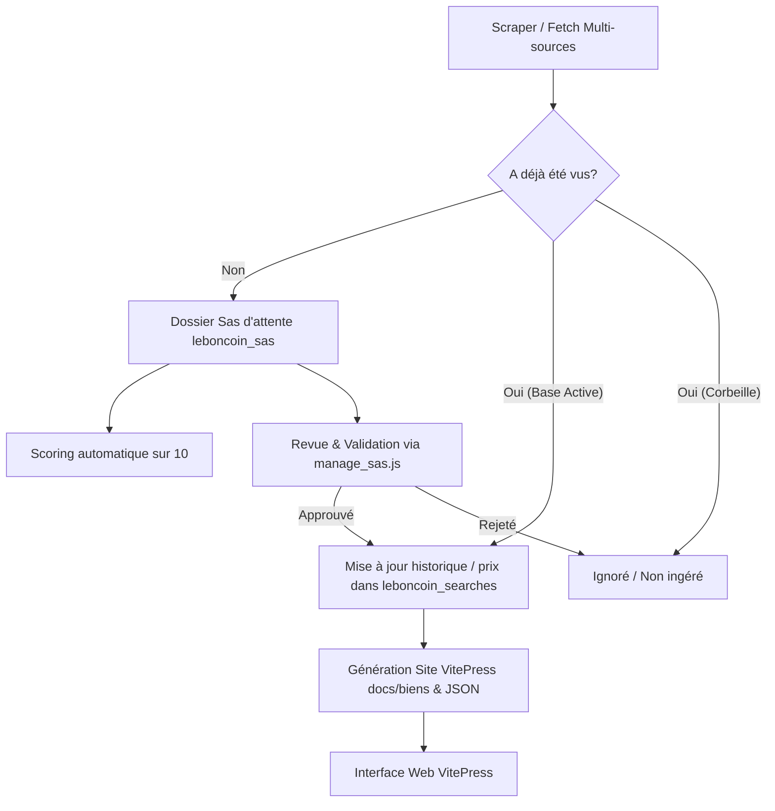

# Consignes de Naming et Règles de Localisation

Ce document regroupe les règles de formatage et de naming à appliquer sur les annonces immobilières de Brest.

## Règle de Naming (Titre Personnalisé)

> [!IMPORTANT]
> Pour chaque annonce immobilière, le titre de la fiche markdown **doit inclure la localisation précise** (le quartier ou secteur) dès qu'il est identifiable dans le titre d'origine, la description ou les métadonnées. Il ne faut pas se contenter de la mention générique "Brest".
> 
> **Exclusion stricte pour absence de quartier** : Toute annonce pour laquelle **aucun quartier reconnu ne peut être identifié** est **strictement éliminée**. Elle est ignorée au fetch (`fetch_listings.js`) et déplacée automatiquement en `corbeille/` lors du scoring (`score_listings.js`).

### Quartiers reconnus et prioritaires
Les quartiers suivants doivent être extraits et insérés au centre du titre :
- **Siam** / **Triangle d'Or** / **Saint-Louis**
- **Place Wilson** / **Gare** / **Branda**
- **Saint-Michel** / **Gambetta** / **Pasteur**
- **Capucins** / **Recouvrance** / **Kerbonne** / **La Corniche**
- **Saint-Marc** (Hors secteur) / **Guelmeur** / **Saint-Martin**
- **Kérinou** / **Lanrédec** / **Linois**
- **Harteloire** / **Bellevue** / **Pilier Rouge**
- **Port de Commerce**

### Format du Titre dans les Fiches
Le titre principal de la fiche doit respecter le format suivant :
`# [Source] - type_de_bien [caractéristiques_temporelles/architecturales] Quartier - [attributs] (Score: X/10)`

Exemples :
- `# [Agence Henry] - maison années 30 Kérinou - jardin (Score: 7/10)`
- `# [Leboncoin] - appartement - 3 pièces 100m² (La Corniche) (Score: 2.4/10)`
- `# [Agence Henry] - grand appartement Branda Gare - seul à l'étage avec ascenseur (Score: 6.7/10)`

---

# Architecture, Mécanismes et Skills ImmoBrest

Ce document décrit le fonctionnement global de la plateforme d'analyse et de recherche immobilière sur Brest.

## 1. Ce que propose l'application ImmoBrest

ImmoBrest est une plateforme automatisée de recherche, d'évaluation et de consultation de biens immobiliers sur Brest centre. Elle permet de :
- **Agréger les annonces** issues de plusieurs sources (Leboncoin, Agence Henry, Luxior, Barraine, Human Immobilier ; Castorus désactivé car agrégateur).
- **Filtrer strictement** selon la surface (85–150m²) et le budget (300k–600k€).
- **Dédoublonner automatiquement** les annonces publiées sur plusieurs portails.
- **Sécuriser la base active via un Sas d'attente** afin de vérifier les nouvelles annonces avant publication.
- **Évaluer et noter chaque bien sur 10 points** selon une grille multicritères (Tiers 1: Siam/Wilson/Gare..., Tiers 2: Saint-Michel/Gambetta/Fac de médecine/Facultés/Yves Collet/Capucins..., Tiers 3: Autres). Exclusions strictes: Croix-Rouge, Bellevue, Saint-Marc, Lambézellec, Bohars, Saint-Pierre, Quatre Moulins, Kerbonne, Fontaine Margot, Les Jardins de la Falaise, Rive Droite (hors Capucins/Recouvrance).
- **Croiser avec les ventes réelles DVF (DGFiP)** géolocalisées sur Brest.
- **Générer un site statique dynamique VitePress** proposant un tableau de bord interactif, des filtres et des fiches détaillées avec historique des prix.

---

## 2. Structure des Dossiers de Données

- `leboncoin_searches/` : **Base active** des annonces confirmées et publiées sur le site.
- `leboncoin_sas/` : **Sas d'attente** hébergeant les nouvelles annonces détectées lors des sessions de fetch, en attente de validation.
- `corbeille/` : **Corbeille** des annonces rejetées ou supprimées (sert également d'anti-doublon pour ne jamais ré-ingérer une annonce rejetée).
- `dvf_data/` : Données historiques brutes et parsées des transactions immobilières réelles de la DGFiP sur Brest.
- `docs/` : Code source et contenu du site statique VitePress (`docs/biens/`, `docs/public/listings_data.json`).

---

## 3. Principaux Mécanismes du Pipeline

1. **Ingestion (Fetch & Multi-dédoublonnage)** :
   - Scan Chrome Debugging sur Leboncoin + requêtes HTTP sur agences partenaires.
   - Contrôle anti-doublon global (recherche dans `leboncoin_searches/`, `leboncoin_sas/` et `corbeille/`).
2. **Sas d'attente (Staging)** :
   - Toute nouvelle propriété entre dans `leboncoin_sas/`.
   - Le scoring est immédiatement calculé pour faciliter la décision.
3. **Validation / Modération** :
   - L'utilisateur ou l'agent valide (`manage_sas.js approve`) ou rejette (`manage_sas.js reject`).
4. **Scoring Multicritères** :
   - Note initiale de 10/10 déduite des maluses (Tiers localisation, prestations manquantes) et agrémentée de bonus qualité (+0.2 par mot-clé, max +1.0).
5. **Publication HTML (VitePress)** :
   - Exécution de `generate_site.js` pour créer les fiches markdown dans `docs/biens/` et la base JSON `docs/public/listings_data.json`.

---

## 4. Catalogue des Skills & Helper Scripts

### 🔍 `leboncoin_fetch` (Ingestion & Gestion du Sas)
- **Scraper d'annonces** : `node .agents/skills/leboncoin_fetch/scripts/fetch_listings.js`
- **Lister le Sas d'attente** : `node .agents/skills/leboncoin_fetch/scripts/manage_sas.js list`
- **Valider une annonce du Sas** : `node .agents/skills/leboncoin_fetch/scripts/manage_sas.js approve <id|all>`
- **Rejeter une annonce du Sas** : `node .agents/skills/leboncoin_fetch/scripts/manage_sas.js reject <id|all>`

### 📊 `leboncoin_scoring` (Calcul des Notes)
- **Scorer toutes les annonces (actives + sas)** : `node .agents/skills/leboncoin_scoring/scripts/score_listings.js`

### 💻 `leboncoin_display` (Consultation CLI)
- **Afficher les annonces actives** : `node .agents/skills/leboncoin_display/scripts/display_listings.js`
- **Afficher les annonces du Sas d'attente** : `node .agents/skills/leboncoin_display/scripts/display_listings.js --sas`

### 🌐 `leboncoin_generate_site` (Génération Web)
- **Régénérer les fiches et données du site** : `node .agents/skills/leboncoin_generate_site/scripts/generate_site.js`
- **Lancer le serveur de développement VitePress** : `npm run dev`

### 🗺️ `dvf` (Données Ventes Réelles DGFiP)
- **Télécharger et géolocaliser les données DVF sur Brest** : Voir instructions dans `.agents/skills/dvf/SKILL.md`.

